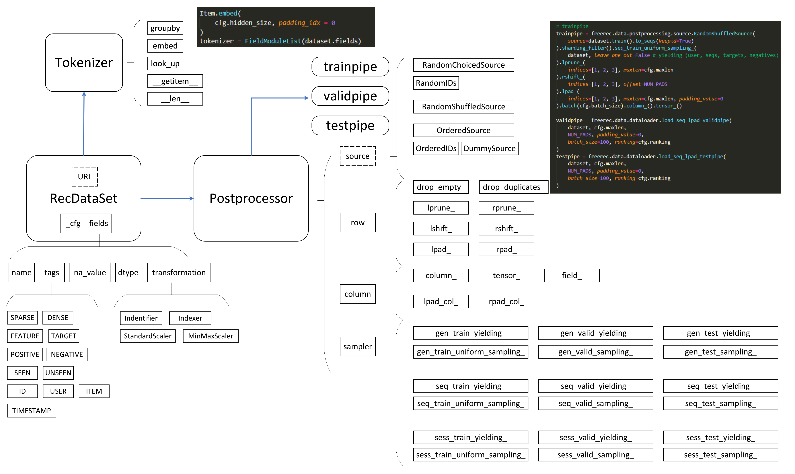
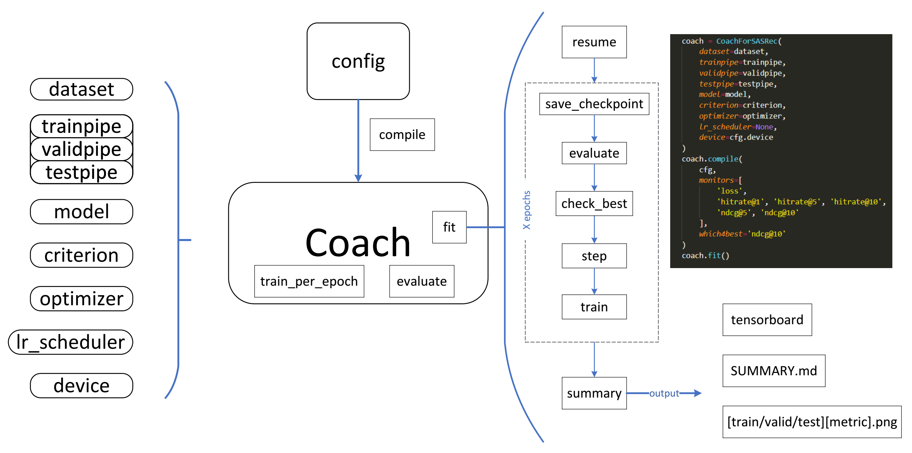

<h4 align="center">
    <p>
        <a href="https://mtandhj.github.io/freerec/">Documentation</a> |
        <a href="https://github.com/MTandHJ/RecBoard">RecBoard</a>
    </p>
</h4>

FreeRec is a repository designed for easy (recommendation) data pre-processing and model training. You are free to specify your own framework based on FreeRec.


## Requirements

Python >= 3.9 | [PyTorch >= 2.0](https://pytorch.org/)


```bash
# 1. Install PyTorch (choose the CUDA version that matches your environment)
#    See https://pytorch.org/get-started/locally/
pip install torch

# 2. Install FreeRec
pip install freerec

# 3. Install torchdata (handled automatically with --no-deps)
freerec setup
```

> [!NOTE]
> FreeRec relies on torchdata 0.7.0, as later releases no longer support the datapipe functionality.
> `freerec setup` installs it with `--no-deps` to avoid overriding your existing PyTorch installation.

### Optional dependencies

```bash
pip install freerec[graph]    # torch-geometric for graph-based models
pip install freerec[metrics]  # scikit-learn for additional metrics (e.g., ROC-AUC)
pip install freerec[nn]       # einops for attention modules
pip install freerec[all]      # all of the above
```


## Data Pipeline

> Refer to the [documentation](https://mtandhj.github.io/freerec/) for dataset processing and splitting.




## Training Flow





## Reference Code

- TorchRec: https://github.com/pytorch/torchrec 
- DeepCTR-Torch: https://github.com/shenweichen/DeepCTR-Torch
- FuxiCTR: https://github.com/xue-pai/FuxiCTR
- BARS: https://github.com/openbenchmark/BARS
- RecBole: https://github.com/RUCAIBox/RecBole


## Acknowledgements

Thanks to ChatGPT for the annotation of some code. For this reason, some of the comments may be illogical.