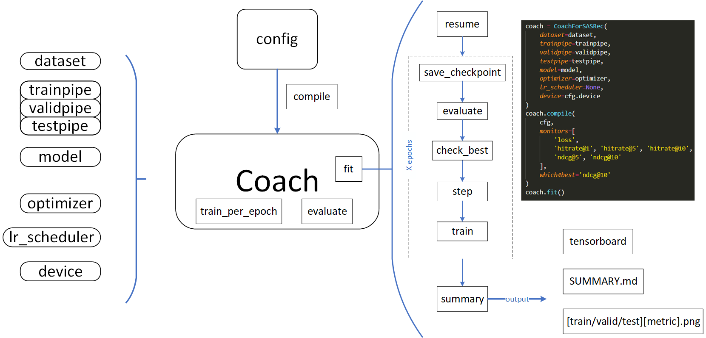

FreeRec is a repository designed for easy (recommendation) data pre-processing and model training.
I am a beginner in the field of recommender systems, so much of FreeRec's designs may not be as effective. In addition, you are free to specify your own framework based on FreeRec.


## Requirements: 

Python >= 3.9 | [PyTorch](https://pytorch.org/) | [TorchData](https://github.com/pytorch/data) | [PyG](https://pytorch-geometric.readthedocs.io/en/latest/notes/installation.html#)


```
conda create --name=FreeRec python=3.9
conda activate FreeRec
```


Note: After PyTorch 2.0, `TorchData` seems to have stopped being updated, and you can install it with `--no-deps` to avoid installing dependencies.

```
pip install --no-deps torchdata
```


## Installation

    pip install freerec

or (for latest)

    pip install git+https://github.com/MTandHJ/freerec.git


## Data Pipeline


**Note:** To make dataset, please download corresponding Atomic files from [[RecBole](https://drive.google.com/drive/folders/1so0lckI6N6_niVEYaBu-LIcpOdZf99kj)]. 
Then, run `make_dataset.ipynb'.

## Training Flow





## Reference Code

- TorchRec: https://github.com/pytorch/torchrec 
- DeepCTR-Torch: https://github.com/shenweichen/DeepCTR-Torch
- FuxiCTR: https://github.com/xue-pai/FuxiCTR
- BARS: https://github.com/openbenchmark/BARS
- RecBole: https://github.com/RUCAIBox/RecBole


## Acknowledgements

Thanks to ChatGPT for the annotation of some code. For this reason, some of the comments may be illogical.
