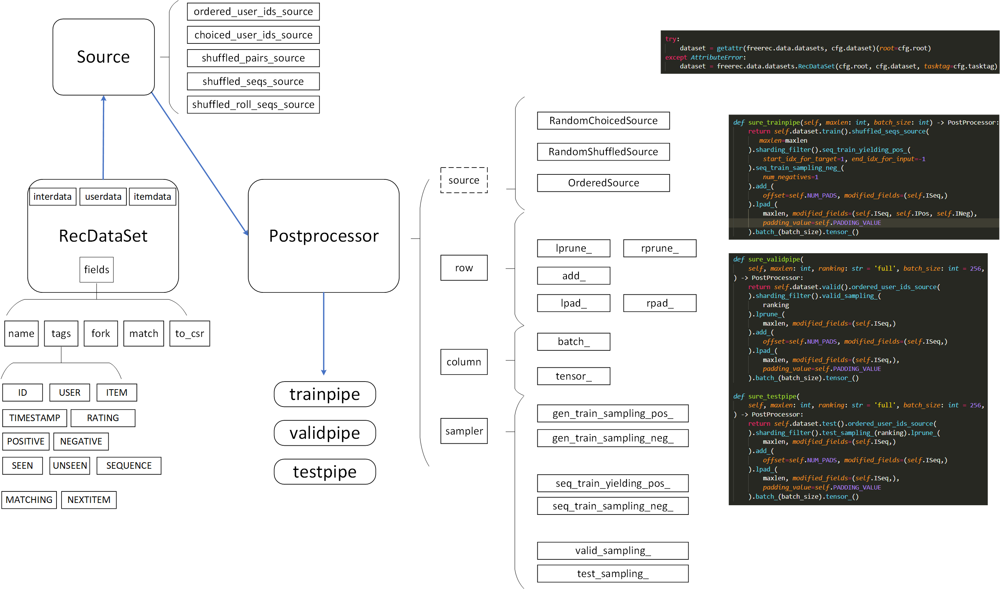

<h4 align="center">
    <p>
        <a href="https://github.com/MTandHJ/freerec/blob/master/dataset%20processing.md">Dataset processing</a> |
        <a href="https://github.com/MTandHJ/freerec/blob/master/training%20and%20tuning.md">Training and Tuning</a> |
        <a href="https://github.com/MTandHJ/RecBoard">RecBoard</a>
    </p>
</h4>

FreeRec is a repository designed for easy (recommendation) data pre-processing and model training. You are free to specify your own framework based on FreeRec.


## Requirements: 

3.9 <= Python <= 3.11 | [PyTorch >=2.0](https://pytorch.org/) | [PyG >=2.3](https://pytorch-geometric.readthedocs.io/en/latest/notes/installation.html#)


```
conda create --name=FreeRec python=3.9
conda activate FreeRec
```

```
pip install --no-deps torchdata==0.7.0
```

> [!NOTE]
> FreeRec must rely on torchdata version 0.7.0/0.7.1, as later releases no longer support the datapipe functionality.


## Installation

    pip install freerec

or (for latest)

    pip install git+https://github.com/MTandHJ/freerec.git


## Data Pipeline

> Refer to [here](./dataset%20processing.md) for dataset processing and splitting.




## Training Flow


## Reference Code

- TorchRec: https://github.com/pytorch/torchrec 
- DeepCTR-Torch: https://github.com/shenweichen/DeepCTR-Torch
- FuxiCTR: https://github.com/xue-pai/FuxiCTR
- BARS: https://github.com/openbenchmark/BARS
- RecBole: https://github.com/RUCAIBox/RecBole


## Acknowledgements

Thanks to ChatGPT for the annotation of some code. For this reason, some of the comments may be illogical.