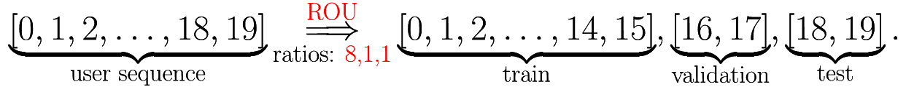
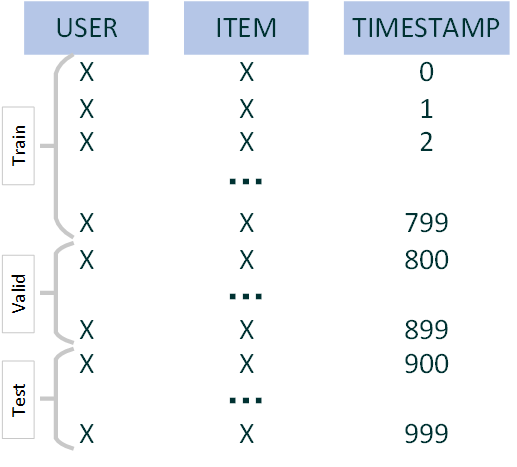

## Dataset Processing


### Step 1: prepare the raw dataset

Suppose the raw dataset is saved as follows:

```
└──data
    └──MovieLens1M
          ├──MovieLens1M.inter
          ├──MovieLens1M.user
          └──MovieLens1M.item
```
- `.inter` file stores the interaction data. It looks like

    ```
    USER	ITEM	RATING	TIMESTAMP
    1	1193	5	978300760
    1	661	3	978302109
    1	914	3	978301968
    1	3408	4	978300275
    1	2355	5	978824291
    ```

- `.user` file stores the user features. It looks like

    ```
    USER	AGE	GENDER	OCCUPATION	ZIP_CODE
    1	1	F	10	48067
    2	56	M	16	70072
    3	25	M	15	55117
    4	45	M	7	02460
    5	25	M	20	55455
    ```

- `.item` file stores the item features. It looks like

    ```
    ITEM	MOVIE_TITLE	RELEASE_YEAR	GENRE
    1	Toy Story	1995	Animation Children's Comedy
    2	Jumanji	1995	Adventure Children's Fantasy
    3	Grumpier Old Men	1995	Comedy Romance
    4	Waiting to Exhale	1995	Comedy Drama
    5	Father of the Bride Part II	1995	Comedy
    ```

**Note:** FreeRec is able to process the `atmoic-like` files introduced in [RecBole](https://github.com/RUCAIBox/RecSysDatasets).

Then, in this case, we have
- `root`: `data`
- `filedir`: `MovieLens1M`
- `userColname`: `USER`
- `itemColname`: `ITEM`
- `ratingColname`: `RATING`
- `timestampColname`: `TIMESTAMP`

### Step 2: splitting using `freerec make`

The following command can be used to split dataset:

```
freerec make [Dataset Name] --root [root] --filedir [filedir] --splitting [splitting method] --star4pos [filter by >= star/rating] --kcore4user [filter by >= kcore4user] --ratios [ratios] --days [days] --userColname [colname of user id] --itemColname [colname of item id] --ratingColname [colname of rating] --timestampColname [colname of timestamp]
```

- `dataset`: the 'output' dataset name
- `root`: root path
- `filedir`: using `dataset` instead if given `None` (default)
- `splitting`: splitting method
    - `ROU`: Ratio On User.
        

    - `ROD`: Ratio On Dataset (according to `ratios`)
        - `train`: some of the earliest interactions
        - `valid`: some of the interactions in the middle period
        - `test`: the last interactions
        

    - `LOU`: Leave-One-Out
        

    - `DOU`: Day On User
        - `train`: all users whose last interaction occurred before `last_timestamp - 2 * days`
        - `valid`: all users whose last interaction occurred between `last_timestamp - 2 * days` and `last_timestamp - days`
        - `test`: all users whose last interaction occurred after `last_timestamp - days`

    - `DOD`: Day On Dataset
        - `train`: all interactions occurred before `last_timestamp - 2 * days`
        - `valid`: all interactions occurred between `last_timestamp - 2 * days` and `last_timestamp - days`
        - `test`: all interactions occurred after `last_timestamp - days`
- `star4pos`: interactions will be filtered by `Rating >= star4pos` (default 0)
- `kcore4user`: users will be filtered by $|\{i: (u, i) \in \mathcal{E}\}| \ge k$ (default $k=10$)
- `kcore4item`: items will be filtered by $|\{u: (u, i) \in \mathcal{E}\}| \ge k$ (default $k=10$)
- `userColname`: the column name of User ID (default: USER)
- `itemColname`: the column name of Item ID (default: ITEM)
- `ratingColname`: the column name of Rating (default: RATING)
- `timestampColname`: the column name of Timestamp (default: TIMESTAMP)

**Note:** `ratingColname` is optional if the dataset has no `Rating` field.

**Note:** For your own datasets or atmoic files downloaded from RecBole, please manually set the `userColname, itemColname, ratingColname, timestampColname`.


Finally, the output dataset will be named as:

    [dataset]_[star4pos][kcore4user][kcore4item][ratios]_[splitting]

### Example

Let us pre-process `MovieLens1M` in a `LOU` fashion with `star4pos=0, kcore4user=5, kcore4item = 5`:

    freerec make MovieLens1M --root ./data --star4pos 0 --kcore4user 5 --kcore4item 5 --spliting LOU

The pre-procssed dataset is placed under the `root/Processed`:

```
└──data
    ├──MovieLens1M
    │      ├──MovieLens1M.inter
    │      ├──MovieLens1M.user
    │      └──MovieLens1M.item
    │ 
    └──Processed
           └──MovieLens1M_550_LOU
                    ├──train.txt 
                    ├──valid.txt 
                    ├──test.txt 
                    ├──user.txt 
                    └──item.txt 
```

And the pre-processed files look like:
- `train.txt`:
    ```
    USER	ITEM	RATING	TIMESTAMP
    0	2143	4.0	978300019.0
    0	256	5.0	978300055.0
    0	675	4.0	978300055.0
    0	26	5.0	978300055.0
    0	1275	3.0	978300103.0
    ```
- `valid.txt`:
    ```
    USER	ITEM	RATING	TIMESTAMP
    0	829	4.0	978824330.0
    1	205	3.0	980638633.0
    2	1593	3.0	977594963.0
    3	3020	5.0	975042337.0
    4	3373	4.0	1008643977.0
    ```
- `test.txt`:
    ```
    USER	ITEM	RATING	TIMESTAMP
    0	2968	5.0	978824351.0
    1	1187	5.0	980638688.0
    2	190	2.0	977594963.0
    3	105	5.0	975042421.0
    4	1629	2.0	1028605534.0
    ```

- `user.txt`:
    ```
    USER	AGE	GENDER	OCCUPATION	ZIP_CODE
    0	1	F	10	48067
    1	35	F	1	95370
    2	35	M	17	95401
    3	25	F	6	90027
    4	25	M	4	90210
    ```

- `item.txt`:
    ```
    ITEM	MOVIE_TITLE	RELEASE_YEAR	GENRE
    0	Toy Story	1995	Animation Children's Comedy
    1	GoldenEye	1995	Action Adventure Thriller
    2	City Hall	1996	Drama Thriller
    3	Curdled	1996	Crime
    4	Ed's Next Move	1996	Comedy
    ```


## Available datasets

The datasets listed below can be downloaded automatically.

### Atomic files

The following datasets are some of (`not-merged`) atmoics files from [RecBole](https://github.com/RUCAIBox/RecSysDatasets). We change their column (field) names to match the FreeRec's requirements. Other raw atmoics file can be used by manually setting `userColname, itemColname, ratingColname, timestampColname`.


|  Dataset   |   Download |
| :-------------: | :-----------: |
| Amazon2014APPs | [link](https://zenodo.org/records/10995912/files/Amazon2014Apps.zip) | 
| Amazon2014Automotive | [link](https://zenodo.org/records/10995912/files/Amazon2014Automotive.zip) | 
| Amazon2014Baby | [link](https://zenodo.org/records/10995912/files/Amazon2014Baby.zip) | 
| Amazon2014Beauty | [link](https://zenodo.org/records/10995912/files/Amazon2014Beauty.zip) | 
| Amazon2014Books | [link](https://zenodo.org/records/10995912/files/Amazon2014Books.zip) | 
| Amazon2014CDs | [link](https://zenodo.org/records/10995912/files/Amazon2014CDs.zip) | 
| Amazon2014Cell | [link](https://zenodo.org/records/10995912/files/Amazon2014Cell.zip) | 
| Amazon2014Clothing | [link](https://zenodo.org/records/10995912/files/Amazon2014Clothing.zip) | 
| Amazon2014Digital | [link](https://zenodo.org/records/10995912/files/Amazon2014Digital.zip) | 
| Amazon2014Electronics | [link](https://zenodo.org/records/10995912/files/Amazon2014Electronics.zip) | 
| Amazon2014Grocery | [link](https://zenodo.org/records/10995912/files/Amazon2014Grocery.zip) | 
| Amazon2014Health | [link](https://zenodo.org/records/10995912/files/Amazon2014Health.zip) | 
| Amazon2014Home | [link](https://zenodo.org/records/10995912/files/Amazon2014Home.zip) | 
| Amazon2014Instant | [link](https://zenodo.org/records/10995912/files/Amazon2014Instant.zip) | 
| Amazon2014Kindle | [link](https://zenodo.org/records/10995912/files/Amazon2014Kindle.zip) | 
| Amazon2014Movies | [link](https://zenodo.org/records/10995912/files/Amazon2014Movies.zip) | 
| Amazon2014Musical | [link](https://zenodo.org/records/10995912/files/Amazon2014Musical.zip) | 
| Amazon2014Office | [link](https://zenodo.org/records/10995912/files/Amazon2014Office.zip) | 
| Amazon2014Patio | [link](https://zenodo.org/records/10995912/files/Amazon2014Patio.zip) | 
| Amazon2014Pet | [link](https://zenodo.org/records/10995912/files/Amazon2014Pet.zip) | 
| Amazon2014Sports | [link](https://zenodo.org/records/10995912/files/Amazon2014Sports.zip) | 
| Amazon2014Tools | [link](https://zenodo.org/records/10995912/files/Amazon2014Tools.zip) | 
| Amazon2014Toys | [link](https://zenodo.org/records/10995912/files/Amazon2014Toys.zip) | 
| Amazon2014Video | [link](https://zenodo.org/records/10995912/files/Amazon2014Video.zip) | 
| Amazon2018AllBeauty | [link](https://zenodo.org/records/10997743/files/Amazon2018AllBeauty.zip) | 
| Amazon2018Appliances | [link](https://zenodo.org/records/10997743/files/Amazon2018Appliances.zip) | 
| Amazon2018Arts | [link](https://zenodo.org/records/10997743/files/Amazon2018Arts.zip) | 
| Amazon2018Automotive | [link](https://zenodo.org/records/10997743/files/Amazon2018Automotive.zip) | 
| Amazon2018Books | [link](https://zenodo.org/records/10997743/files/Amazon2018Books.zip) | 
| Amazon2018CDs | [link](https://zenodo.org/records/10997743/files/Amazon2018CDs.zip) | 
| Amazon2018Cell | [link](https://zenodo.org/records/10997743/files/Amazon2018Cell.zip) | 
| Amazon2018Clothing | [link](https://zenodo.org/records/10997743/files/Amazon2018Clothing.zip) | 
| Amazon2018Digital | [link](https://zenodo.org/records/10997743/files/Amazon2018Digital.zip) | 
| Amazon2018Electronics | [link](https://zenodo.org/records/10997743/files/Amazon2018Electronics.zip) | 
| Amazon2018Fashion | [link](https://zenodo.org/records/10997743/files/Amazon2018Fashion.zip) | 
| Amazon2018Gift | [link](https://zenodo.org/records/10997743/files/Amazon2018Gift.zip) | 
| Amazon2018Grocery | [link](https://zenodo.org/records/10997743/files/Amazon2018Grocery.zip) | 
| Amazon2018Home | [link](https://zenodo.org/records/10997743/files/Amazon2018Home.zip) | 
| Amazon2018Industrial | [link](https://zenodo.org/records/10997743/files/Amazon2018Industrial.zip) | 
| Amazon2018Kindle | [link](https://zenodo.org/records/10997743/files/Amazon2018Kindle.zip) | 
| Amazon2018Luxury | [link](https://zenodo.org/records/10997743/files/Amazon2018Luxury.zip) | 
| Amazon2018Magazine | [link](https://zenodo.org/records/10997743/files/Amazon2018Magazine.zip) | 
| Amazon2018Movies | [link](https://zenodo.org/records/10997743/files/Amazon2018Movies.zip) | 
| Amazon2018Musical | [link](https://zenodo.org/records/10997743/files/Amazon2018Musical.zip) | 
| Amazon2018Office | [link](https://zenodo.org/records/10997743/files/Amazon2018Office.zip) | 
| Amazon2018Patio | [link](https://zenodo.org/records/10997743/files/Amazon2018Patio.zip) | 
| Amazon2018Pet | [link](https://zenodo.org/records/10997743/files/Amazon2018Pet.zip) | 
| Amazon2018Prime | [link](https://zenodo.org/records/10997743/files/Amazon2018Prime.zip) | 
| Amazon2018Software | [link](https://zenodo.org/records/10997743/files/Amazon2018Software.zip) | 
| Amazon2018Sports | [link](https://zenodo.org/records/10997743/files/Amazon2018Sports.zip) | 
| Amazon2018Tools | [link](https://zenodo.org/records/10997743/files/Amazon2018Tools.zip) | 
| Amazon2018Toys | [link](https://zenodo.org/records/10997743/files/Amazon2018Toys.zip) | 
| Amazon2018Video | [link](https://zenodo.org/records/10997743/files/Amazon2018Video.zip) | 
| MovieLens100K | [link](https://zenodo.org/records/10998034/files/MovieLens100K.zip) | 
| MovieLens10M | [link](https://zenodo.org/records/10998034/files/MovieLens10M.zip) | 
| MovieLens1M | [link](https://zenodo.org/records/10998034/files/MovieLens1M.zip) | 
| MovieLens20M | [link](https://zenodo.org/records/10998034/files/MovieLens20M.zip) | 
| Tmall2016Buy | [link](https://zenodo.org/records/10998081/files/Tmall2016Buy.zip) | 
| Tmall2016Click | [link](https://zenodo.org/records/10998081/files/Tmall2016Click.zip) | 
| Gowalla2010 | [link](https://zenodo.org/records/10997653/files/Gowalla2010.zip) | 
| Yelp2018 | [link](https://zenodo.org/records/10998102/files/Yelp2018.zip) | 
| Yelp2021 | [link](https://zenodo.org/records/10998102/files/Yelp2021.zip) | 
| Yelp2022 | [link](https://zenodo.org/records/10998102/files/Yelp2022.zip) | 
| Steam | [link](https://zenodo.org/records/10998197/files/Steam.zip) | 
| RetailrocketAddtocart | [link](https://zenodo.org/records/10998222/files/RetailrocketAddtocart.zip) | 
| RetailrocketTransaction | [link](https://zenodo.org/records/10998222/files/RetailrocketTransaction.zip) | 
| RetailrocketView | [link](https://zenodo.org/records/10998222/files/RetailrocketView.zip) | 
| YahooMusicR1 | [link](https://zenodo.org/records/10998284/files/YahooMusicR1.zip) | 

