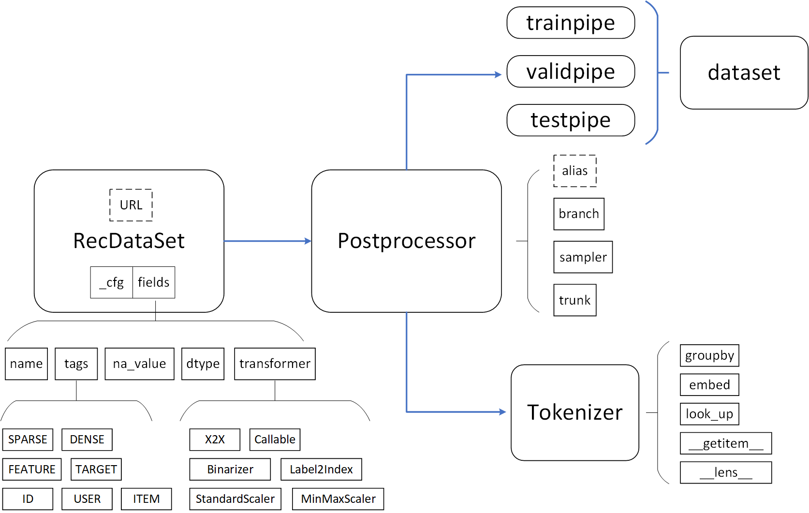

## File Structure

```
┌── datasets
├── postprocessing
├── dataloader.py
├── fields.py
├── sparse.py
├── tags.py
└── utils.py
```

In the following, I will elaborate the details of `RecDataSet` and how to specify your own dataset.


## Flow


- Given the `root` of the dataset, `RecDataSet` will search for available data therein. If none is found, `RecDataSet` will try to download it according to the pre-defined `URL` link.

- Generally, the data is in `csv` format, which is easy to read, but takes a long time to reload. Hence, `RecDataSet` will remake it into `pickle` format.

- Sometimes, the data should be preprocessed, such as mapping categorical features to numbers and normalizing the real-valued data. These operations will be preformed and saved for efficiency.


## How to specify your own dataset ?

- `RecDataSet` requires `_cfg` and `fields` attributes. The latter should be a list of `Field` that is defined in `fields.py`. For exsample, Gowalla_m1 contains implicit feedback only:

```python


class ImplicitRecSet(RecDataSet):
    """Implicit feedback data.
    The data should be collected in the order of users; that is,
    each row represents a user's interacted items.
    """

    open_kw = Config(mode='rt', delimiter=' ', skip_lines=0)

    def file_filter(self, filename: str):
        if self.mode == 'train':
            return 'train' in filename
        else:
            return 'test' in filename

    def raw2data(self) -> dp.iter.IterableWrapper:
        datapipe = dp.iter.FileLister(self.path)
        datapipe = datapipe.filter(filter_fn=self.file_filter)
        datapipe = datapipe.open_files(mode=self.open_kw.mode)
        datapipe = datapipe.parse_csv(delimiter=self.open_kw.delimiter, skip_lines=self.open_kw.skip_lines)
        datapipe = _Row2Pairer(datapipe)
        datapipe = datapipe.map(self.row_processer)
        data = list(datapipe)
        if self.mode == 'train':
            random.shuffle(data)
        datapipe = dp.iter.IterableWrapper(data)
        return datapipe

    def summary(self):
        super().summary()
        from prettytable import PrettyTable
        User, Item = self.fields[USER, ID], self.fields[ITEM, ID]

        table = PrettyTable(['#User', '#Item', '#Interactions', '#Train', '#Test', 'Density'])
        table.add_row([
            User.count, Item.count, self.trainsize + self.test().testsize,
            self.trainsize, self.testsize,
            (self.trainsize + self.testsize) / (User.count * Item.count)
        ])

        infoLogger(table)

class Gowalla_m1(ImplicitRecSet):
    """ GowallaM1: (user, items).
    |  Dataset   | #Users | #Items | #Interactions | #Train  |  #Test  | Density |
    | :--------: | :----: | :----: | :-----------: | :-----: | :-----: | :-----: |
    | Gowalla_m1 | 29,858 | 40,981 |   1,027,370   | 810,128 | 217,242 | 0.00084 |

    See [here](https://github.com/kuandeng/LightGCN/tree/master/Data/gowalla) for details.

    Attributes:
    ---

    _cfg: Config
        - sparse: SparseField
            UserID + ItemID
        - target: SparseField
            Rating
    open_kw: Config
        - mode: 'rt'
        - delimiter: ' '
        - skip_lines: 0

    """

    URL = "https://zenodo.org/record/7184851/files/Gowalla_m1.zip"

    _cfg = Config(
        sparse = [
            SparseField(name='UserID', na_value=None, dtype=int, tags=[USER, ID]),
            SparseField(name='ItemID', na_value=None, dtype=int, tags=[ITEM, ID]),
        ]
    )

    _cfg.fields = _cfg.sparse

    open_kw = Config(mode='rt', delimiter=' ', skip_lines=0)

```

- There are two sparse fields including `UserID` and `ItemID`.  The `na_value` of `None` means it should not be missing data. If it is other available value like `-1`, the missing data will be replaced by `na_value` in default. The purpose of `None` here is to check the completeness of the raw data. `tags` can be used to filter fields of interest. `SparseField` has a default `transformer` of `Label2Index` which mapping values into unique IDs.

- Then, you should implement the `raw2data` method to read the training, valid and test data respectively.


## Example

```python
import freerec
from freerec.data.tags import USER, ITEM, ID
from freerec.data.fields import Tokenizer

basepipe = getattr(freerec.data.datasets, cfg.dataset)(cfg.root) # RecDataSet
trainpipe = basepipe.shard_().uniform_sampling_(num_negatives=1).tensor_().split_(cfg.batch_size) # basepipe -> sampling -> to_tensor -> get batch
validpipe = basepipe.trisample_(batch_size=2048).shard_().tensor_() # basepipe -> sampling -> to_tensor
dataset = trainpipe.wrap_(validpipe).group_((USER, ITEM)) # (trainpipe, validpipe) -> dataset[trainpipe, validpipe, testpipe]

tokenizer = Tokenizer(basepipe.fields.groupby(ID))
tokenizer.embed(
    cfg.embedding_dim, ID
)
```