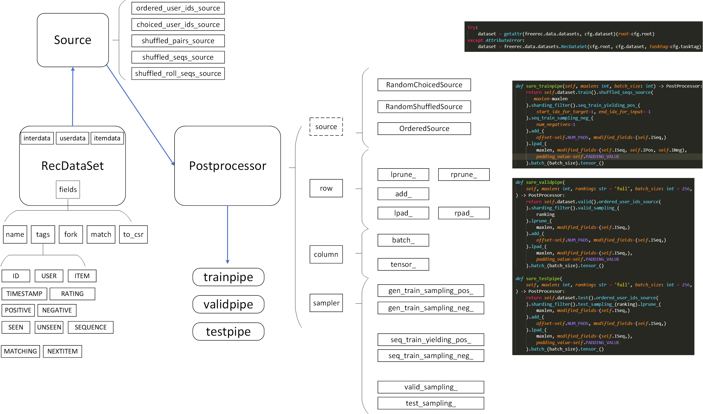
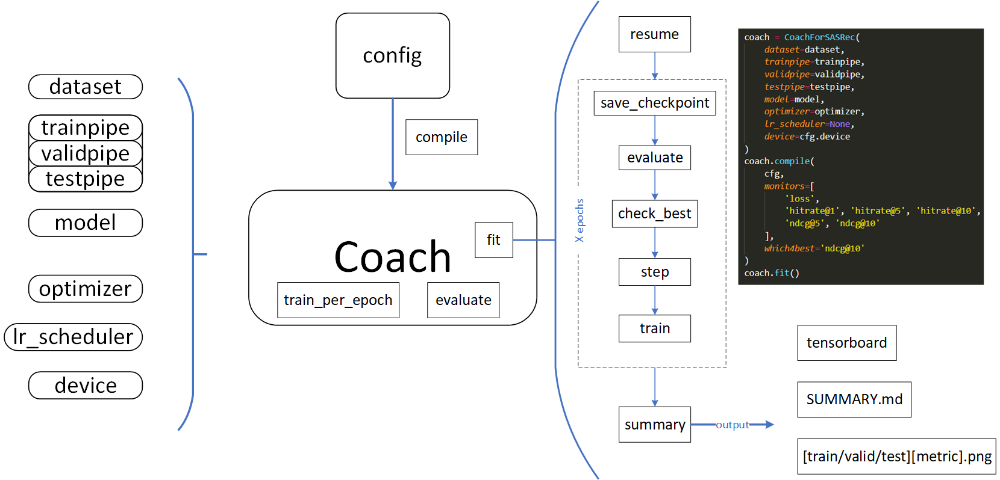

FreeRec
=======

FreeRec 是一个基于 PyTorch 的推荐系统库，提供从数据预处理到模型训练的全流程支持。

.. code-block:: bash

   pip install freerec

核心特性
--------

- **数据处理流水线** — 内置 30+ 公开数据集，一键完成拆分与过滤
- **模型架构基类** — 通用推荐、序列推荐、评分预测等基类，快速搭建模型
- **丰富的评估指标** — Precision、Recall、NDCG、AUC 等 20+ 指标
- **灵活的训练框架** — YAML 配置驱动，支持分布式训练与超参搜索
- **可选图神经网络** — 集成 PyG，支持图推荐模型（如 LightGCN）

数据流水线
----------

训练流程
--------

.. toctree::
   :maxdepth: 2
   :caption: 入门

   installation
   quickstart

.. toctree::
   :maxdepth: 2
   :caption: 教程

   tutorials/index

.. toctree::
   :maxdepth: 2
   :caption: API 参考

   api/index
