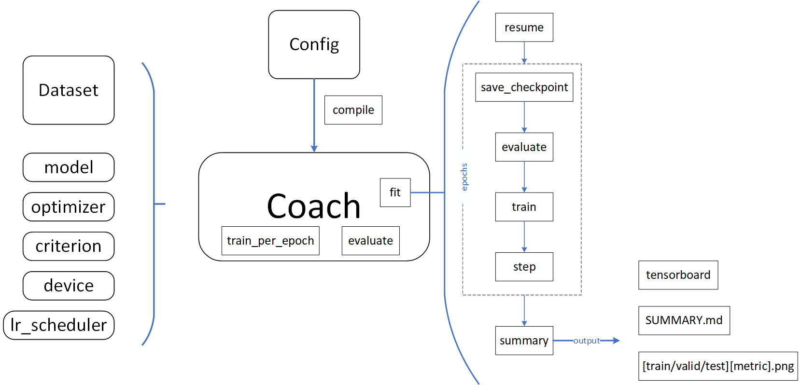

## File Structure

```
┌── criterions.py
├── dict2obj.py
├── launcher.py
├── metrics.py
├── parser.py
└── utils.py
```


## Flow

- Generate `config` through `Parser`:
```python
from typing import Dict, Optional, Union

from freerec.parser import Parser

cfg = Parser()
cfg.add_argument("-eb", "--embedding-dim", type=int, default=64)
cfg.set_defaults(
    description="BPRMF",
    root="../../data",
    dataset='Gowalla_m1',
    epochs=500,
    batch_size=2048,
    optimizer='adam',
    lr=1e-3,
    weight_decay=1e-8,
    seed=1
)
cfg.compile()

```

- Define your own model:


```python
from freerec.models import RecSysArch
from freerec.data.fields import Tokenizer
from freerec.data.tags import USER, ITEM, ID

class BPRMF(RecSysArch):

    def __init__(self, tokenizer: Tokenizer) -> None:
        super().__init__()

        self.tokenizer = tokenizer
        self.User, self.Item = self.tokenizer[USER, ID], self.tokenizer[ITEM, ID]

        self.initialize()

    def forward(
        self, users: Optional[Dict[str, torch.Tensor]] = None, 
        items: Optional[Dict[str, torch.Tensor]] = None
    ):
        if self.training:
            users, items = users[self.User.name], items[self.Item.name]
            userEmbs = self.User.look_up(users) # B x 1 x D
            itemEmbs = self.Item.look_up(items) # B x n x D
            return torch.mul(userEmbs, itemEmbs).sum(-1)
        else:
            return self.User.embeddings.weight, self.Item.embeddings.weight
```

- Implement `train_per_epoch` and `evaluate`:

```python
from freerec.launcher import Coach

class CoachForBPRMF(Coach):

    def train_per_epoch(self):
        for users, items in self.dataloader:
            users = {name: val.to(self.device) for name, val in users.items()}
            items = {name: val.to(self.device) for name, val in items.items()}

            scores = self.model(users, items)
            pos, neg = scores[:, 0], scores[:, 1]
            loss = self.criterion(pos, neg)

            self.optimizer.zero_grad()
            loss.backward()
            self.optimizer.step()
            
            self.monitor(loss.item(), n=scores.size(0), mode="mean", prefix='train', pool=['LOSS'])

    def evaluate(self, prefix: str = 'valid'):
        User = self.fields[USER, ID]
        Item = self.fields[ITEM, ID]
        userFeats, itemFeats = self.model()
        for users, items in self.dataloader:
            users = users[User.name].to(self.device)
            targets = items[Item.name].to(self.device)
            users = userFeats[users].flatten(1) # B x D
            items = itemFeats.flatten(1) # N x D
            preds = users @ items.T # B x N
            preds[targets == -1] = -1e10
            targets[targets == -1] = 0

            self.monitor(
                preds, targets,
                n=len(users), mode="mean", prefix=prefix,
                pool=['NDCG', 'RECALL']
            )

```

- Prepare basic modules:

```python
import torch
from freerec.criterions import BPRLoss

basepipe = getattr(freerec.data.datasets, cfg.dataset)(cfg.root)
trainpipe = basepipe.shard_().uniform_sampling_(num_negatives=1).tensor_().split_(cfg.batch_size)
validpipe = basepipe.trisample_(batch_size=2048).shard_().tensor_()
dataset = trainpipe.wrap_(validpipe).group_((USER, ITEM))

tokenizer = Tokenizer(basepipe.fields.groupby(ID))
tokenizer.embed(
    cfg.embedding_dim, ID
)
model = BPRMF(tokenizer)

if cfg.optimizer == 'sgd':
    optimizer = torch.optim.SGD(
        model.parameters(), lr=cfg.lr, 
        momentum=cfg.momentum,
        nesterov=cfg.nesterov,
        weight_decay=cfg.weight_decay
    )
elif cfg.optimizer == 'adam':
    optimizer = torch.optim.Adam(
        model.parameters(), lr=cfg.lr,
        betas=(cfg.beta1, cfg.beta2),
        weight_decay=cfg.weight_decay
    )
criterion = BPRLoss()

coach = CoachForBPRMF(
    model=model,
    dataset=dataset,
    criterion=criterion,
    optimizer=optimizer,
    lr_scheduler=None,
    device=cfg.device
)
coach.compile(cfg, monitors=['loss', 'recall@10', 'recall@20', 'ndcg@10', 'ndcg@20'])
```

- Train the model:
```python
coach.fit()
```

