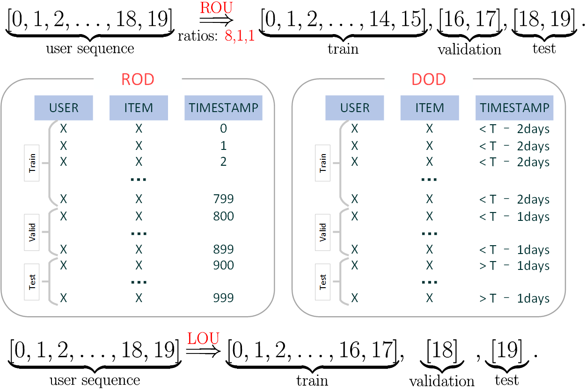

数据集处理
==========

FreeRec 使用 ``freerec make`` 命令对原始数据集进行拆分和过滤，生成可直接用于训练的标准格式。

原始数据格式
------------

FreeRec 采用与 `RecBole <https://github.com/RUCAIBox/RecSysDatasets>`_ 兼容的 atomic 文件格式。
原始数据集目录结构如下：

.. code-block:: text

   data/
   └── MovieLens1M/
       ├── MovieLens1M.inter    # 交互数据
       ├── MovieLens1M.user     # 用户特征（可选）
       └── MovieLens1M.item     # 物品特征（可选）

各文件均为 Tab 分隔的文本文件，首行为列名。

``.inter`` 文件示例：

.. code-block:: text

   USER	ITEM	RATING	TIMESTAMP
   1	1193	5	978300760
   1	661	3	978302109

``.user`` 文件示例：

.. code-block:: text

   USER	AGE	GENDER	OCCUPATION	ZIP_CODE
   1	1	F	10	48067

``.item`` 文件示例：

.. code-block:: text

   ITEM	MOVIE_TITLE	RELEASE_YEAR	GENRE
   1	Toy Story	1995	Animation Children's Comedy

命令行参数
----------

.. code-block:: bash

   freerec make <dataset> [OPTIONS]

**必选参数：**

- ``dataset`` — 数据集名称（如 ``MovieLens1M``）

**常用选项：**

.. list-table::
   :header-rows: 1
   :widths: 25 15 60

   * - 参数
     - 默认值
     - 说明
   * - ``--root``
     - ``data``
     - 数据根目录
   * - ``--filedir``
     - 同 dataset
     - 存放 atomic 文件的子目录名
   * - ``--splitting``
     - （必填）
     - 拆分方法，见下表
   * - ``--ratios``
     -
     - 拆分比例（用于 ROU/ROD）
   * - ``--days``
     -
     - 拆分天数（用于 DOU/DOD）
   * - ``--star4pos``
     - 0
     - 保留评分 >= 该值的交互
   * - ``--kcore4user``
     - 10
     - 用户至少有 k 条交互
   * - ``--kcore4item``
     - 10
     - 物品至少有 k 条交互

**列名设置** （仅在列名不是默认值时需要指定）：

- ``--userColname`` — 用户 ID 列名（默认 ``USER``）
- ``--itemColname`` — 物品 ID 列名（默认 ``ITEM``）
- ``--ratingColname`` — 评分列名（默认 ``RATING``，无评分可省略）
- ``--timestampColname`` — 时间戳列名（默认 ``TIMESTAMP``）

拆分方法
--------

|

.. list-table::
   :header-rows: 1
   :widths: 10 30 30 30

   * - 方法
     - 训练集
     - 验证集
     - 测试集
   * - **ROU**
     - 每个用户最早的部分交互
     - 每个用户中间时段的交互
     - 每个用户最后的交互
   * - **RAU**
     - 同 ROU，但保证测试集至少一条
     - 同 ROU
     - 至少保留一条
   * - **ROD**
     - 全局最早的部分交互
     - 全局中间时段的交互
     - 全局最后的交互
   * - **LOU**
     - 每个用户序列（除最后两条）
     - 每个用户倒数第二条
     - 每个用户最后一条
   * - **DOU**
     - 最后交互在 T-2d 之前的用户
     - 最后交互在 T-2d 至 T-d 之间的用户
     - 最后交互在 T-d 之后的用户
   * - **DOD**
     - T-2d 之前的全部交互
     - T-2d 至 T-d 之间的交互
     - T-d 之后的全部交互

完整示例
--------

以 MovieLens1M、LOU 拆分、kcore=5 为例：

.. code-block:: bash

   freerec make MovieLens1M --root ./data --star4pos 0 --kcore4user 5 --kcore4item 5 --splitting LOU

输出目录：

.. code-block:: text

   data/
   ├── MovieLens1M/         # 原始数据
   └── Processed/
       └── MovieLens1M_550_LOU/
           ├── train.txt
           ├── valid.txt
           ├── test.txt
           ├── user.txt
           └── item.txt

输出的数据格式与输入一致（Tab 分隔），但 USER 和 ITEM 的 ID 已重新编号（从 0 开始）。

.. note::

   此处以 MovieLens1M 为示例，因其易于理解。但如
   `文献 <https://arxiv.org/abs/2307.09985v3>`_ 所述，MovieLens1M
   并非序列推荐的理想基准数据集。

内置数据集
----------

以下数据集可由 FreeRec 自动下载，涵盖 Amazon 2014/2018、MovieLens、Yelp、Steam 等主流推荐数据集。
完整列表请参阅 :mod:`freerec.data.datasets`。

.. tip::

   对于 RecBole 的其他 atomic 文件，只需手动指定
   ``--userColname``、``--itemColname`` 等列名参数即可使用。
